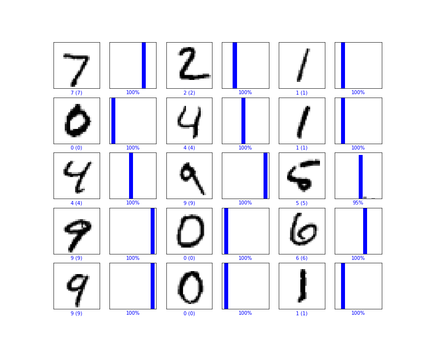

# CPU 2021 여름 방학 특강
본 저장소는 평택고등학교 프로그래밍 동아리 CPU의 여름 방학 특강 참고 자료입니다.
* 강연자: 이석현(@HenryLee97)
* 강연일시: 2021-07-19

## 내용
본 저장소는 아래의 기술들을 체험해 볼 수 있습니다.

### Image Classification
FCN과 CNN을 이용한 MNIST 데이터 분류 [여기](./MNIST.ipynb)

### Style Transfer
VGG-19를 이용한 스타일 전이 [여기](./Style%20Transfer.ipynb)

### GAN
DCGAN과 CGAN을 이용한 MNIST 데이터 생성 [여기](./GAN.ipynb)

